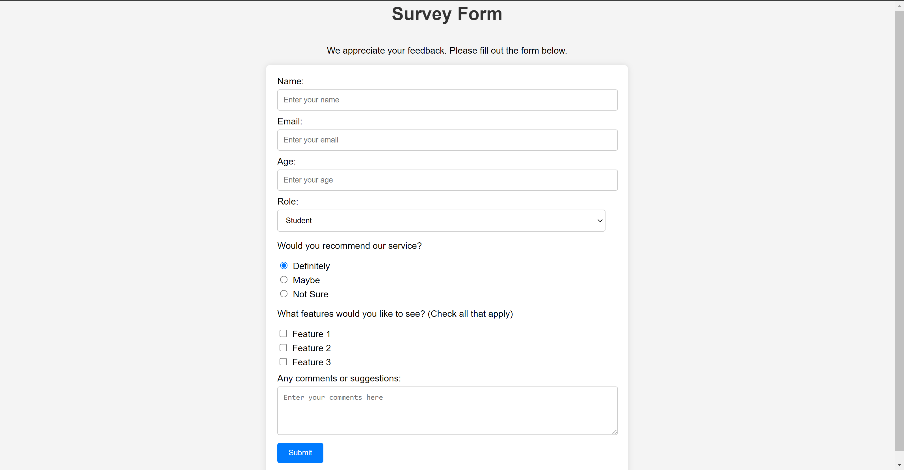

<h1>Survey Form</h1>

A simple survey form built using HTML and CSS, inspired by FreeCodeCamp.

<h2>Description</h2>

This survey form is designed to collect user feedback on various topics. It includes fields for name, email, age, role, service recommendation, desired features, and comments or suggestions.

<h2>Preview</h2>

   

<h2>Project Structure</h2>

<pre>
        survey-form/
        │
        ├── index.html
        ├── style.css
        └── README.md
</pre>

<h2>Usage</h2>

<ol>
        <li>Clone this repository to your local machine.</li>
        <li>Open the index.html file in your web browser.</li>
        <li>Fill out the form with your information and feedback.</li>
        <li>Click the "Submit" button to submit your responses.</li>
</ol>

 <h2>Contributing</h2>

Contributions are welcome! If you'd like to contribute to this project, please follow these steps:

<ol>
        <li>Fork this repository.</li>
        <li>Create a new branch (<code>git checkout -b feature/new-feature</code>).</li>
        <li>Make your changes.</li>
        <li>Commit your changes (<code>git commit -am 'Add new feature'</code>).</li>
        <li>Push to the branch (<code>git push origin feature/new-feature</code>).</li>
        <li>Create a new Pull Request.</li>
    </ol>

 <h2>License</h2>

  
This project is licensed under the MIT License. See the <a href="(https://github.com/Yashi-Singh-1/Survey-Form?tab=MIT-1-ov-file)">LICENSE</a> file for details.

  <h2>Credits</h2>

<ul>
        <li>Based on the project from <a href="https://www.freecodecamp.org/learn/2022/responsive-web-design/build-a-survey-form-project/build-a-survey-form">FreeCodeCamp</a></li>
    </ul>

 <h2>Contact</h2>

  
For any questions or feedback, feel free to reach out:

    <ul>
        <li>LinkedIn: www.linkedin.com/in/yashi-singh-b4143a246</li>
    </ul>
